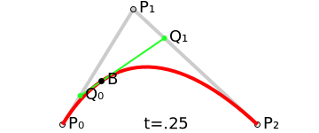
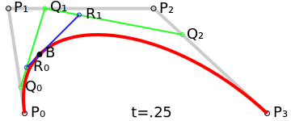

Bezier curve贝塞尔曲线是一种隐式曲线(implicit curve)，通过[de Casteljau算法](https://en.wikipedia.org/wiki/De_Casteljau%27s_algorithm)定义。

Bezier curve由若干个控制点的坐标计算而来，至少有2个控制点，2个控制点所形成的Bezier curve被称为1阶Bezier curve(degree 1)，3个控制点所形成的Bezier curve被称为2阶Bezier curve，以此类推，2阶和3阶的Bezier curve用得最多。

以2阶Bezier curve为例，如下图所示，控制点为$P_0$ $P_1$ $P_2$:

曲线从$P_0$画到$P_2$，假设$P_0$为0时刻，$P_2$为1时刻，那么对于任意$t \in [0, 1]$，曲线上的点的坐标这么计算：

1. 取$P_0P_1$按$t$平分的点$Q_0$，比如图中$t = 0.25$，那么$P_0 Q_0 = 0.25 P_0 P_1$
2. 继续按上面的规则，取$P_1P_2$按$t$平分的点$Q_1$
3. 连接$Q_0Q_1$，取$Q_0Q_1$按$t$平分的点$B$，则点$B$即为所求

绘制过程如下图：

对于3阶Bezier curve，如下图所示，控制点为$P_0$ $P_1$ $P_2$ $P_3$:

曲线从$P_0$画到$P_3$，假设$P_0$为0时刻，$P_3$为1时刻，那么对于任意$t \in [0, 1]$，曲线上的点的坐标这么计算：

1. 取$P_0P_1$按$t$平分的点$Q_0$，比如图中$t = 0.25$，那么$P_0 Q_0 = 0.25 P_0 P_1$
2. 继续按上面的规则，取$P_1P_2$按$t$平分的点$Q_1$
3. 继续按上面的规则，取$P_2P_3$按$t$平分的点$Q_2$
4. 连接$Q_0Q_1$和$Q_1Q_2$，此时$Q_0$ $Q_1$ $Q_2$三个点的情况符合2阶Bezier curve的情况，按照2阶的算法继续计算，得到点$B$

绘制过程如下图：

对于更高阶的Bezier curve，算法过程类似，只是一个很简单的递归算法。

一般3阶用得最多，如果控制点超过4个，则会绘制多个3阶曲线把多个曲线连接起来，如果要求曲线相接处平滑过渡，可以让连接处得三个控制点共线，而且其他2个控制点到相接控制点的距离相同。

把Bezier curve推广到3D空间可以画出Bezier surface，但控制点个数会更多，比如3阶Bezier curve在3D空间需要4 x 4个点，使用[[Texture mapping and antialiasing#Texture magnification]]中的双线性插值方法，先在一个方向上插值出4个点，然后用这4个点的坐标计算Bezier curve上的点，即可算出Bezier surface上的点。

