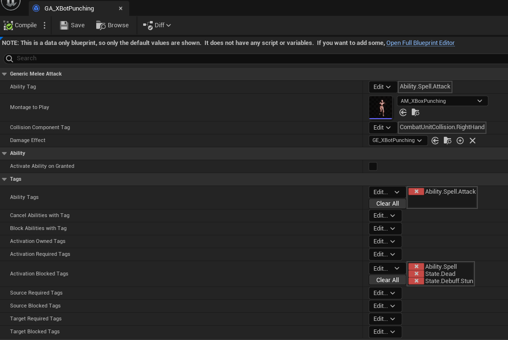

Gameplay Ability System(以下简称GAS)是Unreal Engine的一个引擎插件，用于实现技能。[官方文档](https://docs.unrealengine.com/5.0/en-US/gameplay-ability-system-for-unreal-engine/)有一些相关描述，但不是特别详细，github上有个[比较详细的第三方文档](https://github.com/tranek/GASDocumentation)，主要都是参考这个第三方文档进行开发。

可参考的开源项目有：

- [Action RPG(Offical)](https://docs.unrealengine.com/4.27/en-US/Resources/SampleGames/ARPG/)
- [GASDocumentation](https://github.com/tranek/GASDocumentation)
- [GASShooter](https://github.com/tranek/GASShooter)

## 基本概念和系统框架

要用GAS实现技能，需要先明白一些基础概念。

- GameplayTag: 游戏标签，非常重要的概念，比如技能槽是个标签，眩晕状态是个标签
- GameplayAbility: 技能入口类，定义技能开始释放时的相关逻辑
- AttributeSet: 属性集合，定义技能相关的所有战斗属性
- GameplayEffect: 纯数据类，定义技能产生的效果，AttributeSet里面的所有属性只能通过GameplayEffect来修改，可以用来做Buff / 冲锋 / 击飞等等
- AbilityTask: GameplayAbility只有一个入口函数，如果想要在技能释放过程中有其他逻辑被调用，就需要用AbilityTask，比如播放蒙太奇触发打点
- GameplayCue: 与技能逻辑无关的表现，比如特效音效之类的，必须用GameplayTag来触发，而且GameplayTag必须以`GameplayCue`为根

这些对象里最核心的对象是GameplayEffect，是实现技能效果的最直接对象。除了改变属性，还可以**赋予技能**，比如赋予特定的被动技能，就可以通过GameplayEffect实现冲锋 / 击飞等效果。

## 技能实现示例

比如做个发射投射物的技能，我们可以先定义好这个技能有哪些数据是可以配置的:

- 技能槽对应的GameplayTag
- 要播放的蒙太奇
- 要发射的投射物的蓝图类
- 发射投射物的插槽名
- 投射物命中目标后要触发的GameplayEffect

之所以要定义这些可以配置的数据，是为了能让策划通过蓝图继承程序通过C++写的投射物技能基类，通过蓝图继承给投射物技能配置不同的数据，策划就能快速做出多个不同的投射物技能。

定义好了可配置数据，我们就能先把投射物技能的头文件写好，需要继承UGameplayAbility:

```cpp
UCLASS()
class CLASHONMYOJI_API UGenericProjectileAttack : public UCombatUnitAbilityBase
{
	GENERATED_BODY()

public:
	UGenericProjectileAttack();

	UPROPERTY(EditDefaultsOnly, BlueprintReadOnly)
	FGameplayTag AbilityTag = FGameplayTag::RequestGameplayTag(FName("Ability.Spell.Attack"));

	UPROPERTY(EditAnywhere, BlueprintReadOnly)
	UAnimMontage* MontageToPlay;

	UPROPERTY(EditAnywhere, BlueprintReadOnly)
	TSubclassOf<ACombatProjectile> ProjectileClass;

	UPROPERTY(EditAnywhere, BlueprintReadOnly)
	FName EmitSocketName;

	UPROPERTY(EditAnywhere, BlueprintReadOnly)
	TSubclassOf<UGameplayEffect> DamageEffect;
}
```

然后，定义蒙太奇事件点的GameplayTag，比如约定`Event.Montage.SpawnProjectile`这个GameplayTag是发射投射物的Tag，`Event.Montage.EndAbility`是结束技能的Tag。

接着，在技能的ActivateAbility函数里，调用播放蒙太奇的AbilityTask，并监听蒙太奇事件，遇到上面的Tag时发射投射物或者结束技能。

```cpp
void UGenericProjectileAttack::ActivateAbility(const FGameplayAbilitySpecHandle Handle, const FGameplayAbilityActorInfo* ActorInfo, const FGameplayAbilityActivationInfo ActivationInfo, const FGameplayEventData* TriggerEventData)
{
	if (!CommitAbility(Handle, ActorInfo, ActivationInfo))
	{
		EndAbility(CurrentSpecHandle, CurrentActorInfo, CurrentActivationInfo, true, true);
		return;
	}

	UPlayMontageAndWaitForEventTask* Task = UPlayMontageAndWaitForEventTask::PlayMontageAndWaitForEvent(this, NAME_None, MontageToPlay, FGameplayTagContainer());
	Task->OnBlendOut.AddDynamic(this, &UGenericProjectileAttack::OnCompleted);
	Task->OnCompleted.AddDynamic(this, &UGenericProjectileAttack::OnCompleted);
	Task->OnInterrupted.AddDynamic(this, &UGenericProjectileAttack::OnCancelled);
	Task->OnCancelled.AddDynamic(this, &UGenericProjectileAttack::OnCancelled);
	Task->OnEventReceived.AddDynamic(this, &UGenericProjectileAttack::OnGameplayEventReceived);

	// ReadyForActivation() should be called in C++ to activate the AbilityTask.
	// But in Blueprint, Ability Task is automatically activated by K2Node_LatentGameplayTaskCall
	Task->ReadyForActivation();
}

void UGenericProjectileAttack::OnGameplayEventReceived(FGameplayTag EventTag, FGameplayEventData EventData)
{
	if (EventTag == FGameplayTag::RequestGameplayTag(FName("Event.Montage.EndAbility")))
	{
		EndAbility(CurrentSpecHandle, CurrentActorInfo, CurrentActivationInfo, true, false);
		return;	
	}

	// Only spawn projectiles on the server
	if (GetOwningActorFromActorInfo()->HasAuthority() && EventTag == FGameplayTag::RequestGameplayTag(FName("Event.Montage.SpawnProjectile")))
	{
		ACombatUnit* CombatUnit = Cast<ACombatUnit>(GetAvatarActorFromActorInfo());
		if (!CombatUnit)
		{
			EndAbility(CurrentSpecHandle, CurrentActorInfo, CurrentActivationInfo, true, false);
			return;
		}
		const FRotator Rotation = CombatUnit->GetActorRotation();

		FTransform EmitSocketTransform = CombatUnit->GetMesh()->GetSocketTransform(EmitSocketName);
		EmitSocketTransform.SetRotation(Rotation.Quaternion());
		EmitSocketTransform.SetScale3D(FVector(1.f));

		ACombatProjectile* Projectile = GetWorld()->SpawnActorDeferred<ACombatProjectile>(ProjectileClass, EmitSocketTransform, GetOwningActorFromActorInfo(),CombatUnit, ESpawnActorCollisionHandlingMethod::AlwaysSpawn);
		if (Projectile)
		{
			// Pass extra construct argument if necessary
			Projectile->OnImpact.AddDynamic(this, &UGenericProjectileAttack::OnProjectileHit);
			Projectile->FinishSpawning(EmitSocketTransform);
		}
	}
}
```

最后，当子弹命中单位时，使用GameplayEffect造成一次伤害:

```cpp
void UGenericProjectileAttack::OnProjectileHit(ACombatProjectile* EventInitiator, UPrimitiveComponent* HitComponent, AActor* EventAcceptor, UPrimitiveComponent* OtherComponent, FVector NormalImpulse, const FHitResult& Hit)
{
	if (GetOwningActorFromActorInfo()->GetLocalRole() == ROLE_Authority)
	{
		if (ACombatUnit* CombatUnit = Cast<ACombatUnit>(EventInitiator->GetInstigator()))
		{
			if (ACombatUnit* TargetUnit = Cast<ACombatUnit>(EventAcceptor))
			{
				FGameplayEffectSpecHandle DamageEffectSpecHandle = MakeOutgoingGameplayEffectSpec(DamageEffect, GetAbilityLevel());
				ApplyGameplayEffectSpecToTarget(GetCurrentAbilitySpecHandle(), GetCurrentActorInfo(), GetCurrentActivationInfo(), DamageEffectSpecHandle, UAbilitySystemBlueprintLibrary::AbilityTargetDataFromActor(TargetUnit));
			}
		}
		else
		{
			EndAbility(CurrentSpecHandle, CurrentActorInfo, CurrentActivationInfo, true, true);
		}
	}
}
```

为了让策划可以通过蓝图编辑投射物的相关数值，程序也可以写一个投射物的基类，并暴露可配置的数据，策划用蓝图继承这个基类来配置不同的投射物:

```cpp
UCLASS()
class CLASHONMYOJI_API ACombatProjectile : public AActor
{
	GENERATED_BODY()
	
public:	
	DECLARE_DYNAMIC_MULTICAST_DELEGATE_SixParams(FCombatProjectileImpactDelegate, ACombatProjectile*, Projectile, UPrimitiveComponent*, HitComponent, AActor*, OtherActor, UPrimitiveComponent*, OtherComponent, FVector, NormalImpulse, const FHitResult&, Hit);
	
	// Sets default values for this actor's properties
	ACombatProjectile();

	UPROPERTY(VisibleAnywhere, BlueprintReadOnly, Category="Components")
	TObjectPtr<class USphereComponent> SphereComponent;

	UPROPERTY(VisibleAnywhere, BlueprintReadOnly, Category="Components")
	TObjectPtr<class UStaticMeshComponent> StaticMeshComponent;

	UPROPERTY(VisibleAnywhere, BlueprintReadOnly, Category="Components")
	TObjectPtr<class UProjectileMovementComponent> ProjectileMovementComponent;

	UPROPERTY(EditAnywhere, BlueprintReadWrite, Category="Projectile")
	bool bDestroyOnImpact = true;

	UPROPERTY(BlueprintAssignable)
	FCombatProjectileImpactDelegate OnImpact;

	UPROPERTY(EditAnywhere, BlueprintReadOnly)
	float Range;

protected:
	// Called when the game starts or when spawned
	virtual void BeginPlay() override;

	UFUNCTION(Category="Projectile")
	void OnProjectileImpact(UPrimitiveComponent* HitComponent, AActor* OtherActor, UPrimitiveComponent* OtherComponent, FVector NormalImpulse, const FHitResult& Hit);

};
```

这样定义完成后，策划就可以通过蓝图继承程序所定义的类来配置技能。




## 编辑器支持

编辑得比较多是GameplayEffect和GameplayAbility，这俩都是UObject的派生类，可以用Unreal的蓝图编辑器很方便的编辑，上文也展示了这些技能对象的编辑方式，对于熟悉Unreal的策划来说是非常好上手。

上面的很多GameplayAbility的C++代码，用蓝图也能完成，而且实现起来也不是特别复杂。

对于技能而言，比较复杂的逻辑时下面这些:

- 规定战斗中可以使用的战斗属性
- 属性结算的计算方法
- 支持丰富的AbilityTask
- 技能效果服务端客户端同步

对于这些比较复杂的逻辑，以及一些比较通用的技能或者不想让策划在蓝图里写逻辑的技能，都可以由程序在C++里实现，其他的都可以由策划在蓝图编辑器里完成。

尽管用蓝图做技能的方法本质上也是让策划填数值，最多就是要让策划在蓝图里连一些简单的技能逻辑，看起来和传统的填表方式差不多，但其实整体的编辑体验上是有很大区别的，比如：

- 选择播哪个蒙太奇可以直接在Unreal Editor里可视化完成，而不是复制一份很有可能填错的数据粘贴到Excel表格里，**解决了技能数据和技能动画表现分离的问题**
- 每个技能可以配置哪些数据是完全通过C++定制的，策划在编辑数据时，不会看到冗余的技能数据，但是如果数据全部在表里的话，就会导致表里字段越来越多，策划需要处理的信息就会变得越来越庞大，最后可能大到人脑处理不过来的地步
- 技能的产生物比如投射物也可以通过蓝图编辑，程序可以自定义投射物可以编辑的属性
- 借助蓝图的强大功能，策划可以override一些函数，在C++的基础上自己定制一些技能逻辑，可能程序只是通过C++做了一些很通用的逻辑，但策划就可以通过蓝图派生出五花八门的技能效果

## GAS相关笔记

- GAS接入基础: [[Gameplay Ability System Basic]]
- [[GAS AttributeSet]]
- AI使用技能: [[Customize UBT TaskNode#节点执行逻辑]]
